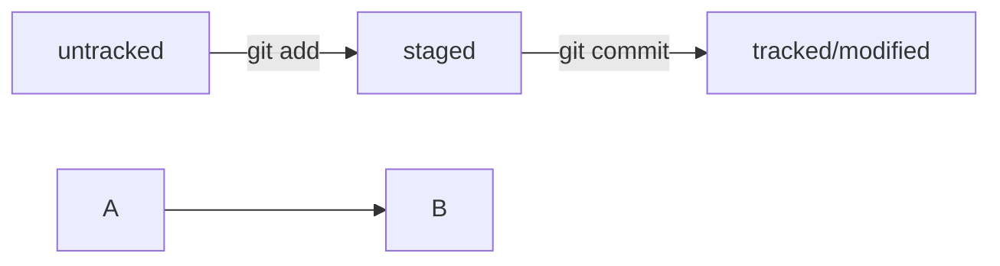

# GIT НАЧАЛО

**VCS** - ПО, позволяющее отслеживать изменения в проекте.

Основными функции VCS являются хранение, управление, анализ истории проекта, а также удобное взаимодействия с историей во время совместной разработки.

**Git** – VCS, помогающая отслеживать изменения в проекте. Git позволяет сохранять изменения локально, а при необходимости можно создать удаленную копию репозитория на хостинге, поддерживающим git.

**Коммит** – сохранение текущего состояние файла. Команда git add не сохраняет содержимое в репозиторий, а служит для подготовки файлов к коммиту. Коммит нужно описывать так, чтобы было понятно какие изменения были внесены в файл.

**Root commit** – первоначальный коммит.

**GitHub** – платформа для хранения it проектов и совместной разработки с использованием git.

**Сетевые протоколы** – правила обмена данными между компьютерами. Один из наиболее распространённых протокола – **SSH** (Secure Shell Protocol), с помощью этого протокола можно получить данные от удаленного компьютера или отправить их туда, трафик шифруется, что обеспечивает безопасность передачи данных. По умолчанию папка с SSH-ключами находится в домашней директории. По сути SSH-ключ – виртуальный идентификатор для GitHub.
SSH состоит из двух ключей:

- Приватный ключ: доступ есть только у одного, используется для расшифровки данных.

- Публичный ключи: доступен всем, используется дли шифрования данных, может быть расшифрован парным приватным ключом.

**Passphrase** – кодовая фраза, нужна для доступа к SSH-ключу. После создания ключа появляются 2 файла, один .pub другой без. Файл .pub – публичный.

**URL** – унифицированный указатель ресурса. При вводе команды git remote add необходимо добавить 2 параметра: имя удаленного репозитория и URL. URL можно скопировать на GitHub.

Чтобы другие пользователи и клиенты смогу понять, что представляет собой проект его нужно описать. Такое описание принято указывать в README.md. Удобство такого формата в том, что некоторые средства совместной разработки отображают содержимое этого файла в виде удобной разметки. (Markdown)Как правило здесь указывают:

* Название проекта и его краткое описание (кем создан, для чего)
* Технологии, которые применяются в проекте. Отличия от аналогов
* Документация проекта, подробная инструкция о проекте
* Планы развития проекта, если они есть

# Навигация по коммитам

**Хэширование** - способ преобразовать данные и получить их отпечаток. Хэш – основной идентификатор коммита. Git хранит таблицу соответствия между хэшом и коммитом, так зная хэш можно узнать информацию о коммите.

**Информация о коммите** – это набор данных: когда был сделан коммит, содержимое файлов в репозитории на момент создания коммита, ссылка на предыдущий или на родительский коммит.

**SHA-1 (Secure Hash Algorithm)** – метод хэширования информации о коммите, использующийся в Git. SHA-1 состоит из 40 символьной строки и включает в себя цифры от 0 до 9 и лат. буквы A-F (регистр не важен). Такая строка обладает следующими свойствами:
-	если входной набор данных один и тот же, то результат гарантированно будет одинаковый
-	если входной набор данных изменится хоть немного, то результат поменяется.

**HEAD** – указатель на последний коммит. Вместо хэша последнего коммита, можно указывать HEAD.

### Статусы файлов в Git

-	**Untracked**. Не отслеживаемые – файлы, о существовании которых Git знает, но не следит за изменениями в нем.
-	**Tracked**. Отслеживаемые – файлы, за изменениями которых Git следит (как правило это закоммиченные и не измененные файлы)
-	**Staged**. (Indexed, Cached). Файлы, добавленные в Staging Area
-	**Modified**. Измененные файлы.

Файл может находится в нескольких состояниях одновременно, к примеру, может быть так, что файл уже добавили в Staging Area и после этого внесли некоторые изменения в этот файл, в таком случае файл будет находится в staged и modified одновременно. Большинство файлов в проектах шагает по следующему циклу: modified, added in staging area, committed, modified и т.д.
